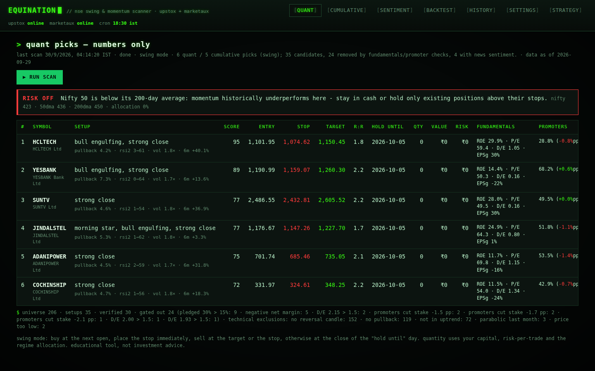

# Equination

A self-hosted web app that pulls NSE prices, key ratios and shareholding
patterns through **your own Upstox API key**, scans every trading day, and
shows you which stocks to buy, with entry, stop-loss, target, holding period and
position size. It never places orders.

Two modes, both gated on fundamentals and promoter behaviour:

- **4-day swing** (default): quality stocks in an uptrend that just pulled back
  and printed a bullish reversal candle.
- **Positional**: monthly momentum rotation with a Nifty regime filter.

Three views of every scan:

- **Quant** — numbers only: the technical setup, ranked by technical score,
  gated on Upstox key ratios and shareholding numbers.
- **Sentiment** — news only: [Marketaux](https://www.marketaux.com) articles
  for each shortlisted stock, scored by entity sentiment with a 3-day
  half-life; the "if I only read the headlines" view.
- **Cumulative** — the blend (default 55% quant / 30% sentiment / 15%
  fundamentals quality, editable), with strongly negative news as a veto.

All of it targets a realistic 1-3% a month on average, with losing months.
The UI is a green-on-black terminal; expect scanlines.



## Quick start

```bash
pip install -r requirements.txt
python run.py            # http://127.0.0.1:8000
```

1. Create an app at `account.upstox.com/developer/apps`. Set its **redirect
   URL** to `http://127.0.0.1:8000/callback`.
2. Open **Settings** in Equination, paste the API key and secret, click
   **Login with Upstox**.
3. Back on the **Dashboard**, click **Run scan now**. The first run downloads
   ~6 years of daily candles for ~200 stocks (about 3-4 minutes under Upstox's
   rate limits); later runs only fetch the missing days.
4. Enable the daily schedule (default 18:30 IST, Mon-Fri). Upstox access
   tokens expire at 03:30 IST every day, so log in once a day before the scan
   runs, or paste a token manually. A scan that finds an expired token is
   marked `needs_login` and the dashboard tells you.
5. Open **Backtest** to see how the exact same rules did on the data you just
   downloaded, versus buying the Nifty 50.
6. Optional: paste a **Marketaux** API token in Settings to enable the
   Sentiment and Cumulative views. The free tier allows 100 requests/day;
   Equination queries only the shortlist (≈ 3 × number of picks) and caches
   each symbol for 12 hours. `GET /api/sentiment/INFY?refresh=true` shows the
   parsed result and the raw articles.

Everything (settings, secret, token, candles, scan history) lives in a local
SQLite file under `data/`. Nothing leaves your machine except calls to Upstox.

## The strategies

Full detail is on the *Strategy* tab in the app.

### Quality and promoter gates (both modes, `app/fundamentals.py`)

Data comes from Upstox's `/v2/fundamentals/{isin}/key-ratios` and
`/share-holdings` endpoints, cached for 7 days.

| Check | Rule |
|---|---|
| Profitability | ROE ≥ 10%, P/E > 0 (not loss-making) and < 80, net margin > 0 |
| Leverage | Debt/equity ≤ 1.5, skipped for banks/NBFCs/insurers |
| Promoters selling | Excluded if promoter stake fell ≥ 1.5 pp over the last two quarters |
| Pledging | Excluded if pledged holdings > 15% (where Upstox reports it) |
| Warnings | Promoter holding < 25%, falling profits, missing data ("unverified") |
| Your list | `Never suggest these symbols` in Settings |

Tick *Exclude stocks where Upstox has no fundamentals data* to make missing
data a hard exclusion. `GET /api/fundamentals/RELIANCE` shows the parsed values
and the raw Upstox payload so the field mapping can be checked.

### News sentiment and the cumulative score (`app/sentiment.py`)

For each shortlisted stock Marketaux is queried for `SYMBOL.NSE` (falling
back to a company-name search restricted to India) over the last 7 days.
Each article's entity `sentiment_score` (−1…1) is weighted by the entity
match score and a 3-day recency half-life:

| Output | Rule |
|---|---|
| Verdict | positive ≥ +0.15, negative ≤ −0.15, else neutral; no_news when nothing scored |
| Sentiment points | 50 + 50 × score × confidence, confidence = 1 − e^(−articles/3) |
| Cumulative score | (w_q × quant percentile + w_s × sentiment points + w_f × quality score) / Σw |
| Veto | score ≤ −0.35 across ≥ 2 articles removes the stock from the cumulative list |

Sentiment is not part of the backtest (no news history), so treat it as a
veto and a tie-breaker, not as a stand-alone signal.

### 4-day swing: quality pullback + reversal candle (`app/swing.py`, `app/patterns.py`)

| Step | Rule |
|---|---|
| Uptrend | 50 DMA > 200 DMA, close > 200 DMA, close ≥ 0.95 × 50 DMA, 6-month return > 0 |
| Pullback | 3-12% below the 20-day high; RSI(2) < 25 within the last 3 sessions |
| Trigger | Morning star, bullish engulfing, piercing, hammer, bullish harami, or a strong high-volume close above yesterday's high |
| Sanity | ATR 1-5% of price, liquid, not up > 25% in a month, Nifty above 200 DMA |
| Rank | 35% trend quality + 20% pullback depth + 30% candle strength + 15% volume |
| Plan | Stop under the pattern low (≤ 2.5 ATR); target = 10-day high or 2R; exit at the close of day N |

The backtest replays every historical setup with the same stop/target/hold and
compares it with buying the same trend-eligible stocks on random days, so you
can see whether the trigger adds anything on your data. A good result is a
58-65% win rate with a profit factor above 1.3.

### Positional: trend-filtered, volatility-adjusted momentum rotation (`app/strategy.py`)

| Step | Rule |
|---|---|
| Regime | Nifty 50 above 50 & 200 DMA → full allocation; above 200 only → half; below 200 → cash |
| Eligibility | ≥ 260 bars, price ≥ ₹50, 20-day turnover ≥ ₹5 cr, above own 50 & 200 DMA, within 25% of 52-week high, ann. vol ≤ 60%, last-month return ≤ 35% |
| Score | `(0.40·R12-1 + 0.35·R6 + 0.25·R3) / vol63` |
| Portfolio | Top 10 by score, equal slots, quantity capped by 1% risk to a 2.5·ATR stop |
| Exits | Close below stop or 50 DMA, or falls out of the top 2N at the monthly review |

Why momentum: it is the most persistent, best-documented return anomaly across
markets including India. Its known weakness (crashes when the market turns) is
what the Nifty regime filter and volatility scaling are there to blunt.
Run the backtest on your own data before trusting it; past performance does
not guarantee future results.

## Deploying (not Vercel)

Equination is a long-running server: it keeps a SQLite database on disk,
runs multi-minute scans in a background thread and hosts its own daily
scheduler. **Serverless platforms such as Vercel or Netlify cannot run it**
(read-only filesystem, short timeouts, no background jobs → `FUNCTION_INVOCATION_FAILED`).

Run it on your own PC, or on any host with a persistent disk using the
included `Dockerfile`:

| Host | Notes |
|---|---|
| Your PC | `python run.py`; keep it on at scan time |
| Fly.io | `fly launch --copy-config --no-deploy`, `fly volumes create equination_data -s 1 -r bom`, `fly secrets set EQUINATION_PASSWORD=… EQUINATION_PUBLIC_URL=https://<app>.fly.dev`, `fly deploy` |
| Railway | New project from repo, add a **Volume** mounted at `/data`, set the env vars below |
| Any VPS | `docker build -t equination . && docker run -d -p 8000:8000 -v equination:/data -e EQUINATION_PASSWORD=… equination` |

When deployed, set these and register `EQUINATION_PUBLIC_URL/callback` as the
redirect URL of your Upstox app:

- `EQUINATION_PASSWORD` — **required** once the app is reachable from the
  internet; it stores your Upstox secret and token. The browser will prompt for
  it (any username).
- `EQUINATION_PUBLIC_URL` — e.g. `https://equination.fly.dev`; sets the default
  OAuth redirect URI.
- `EQUINATION_DATA_DIR=/data` — the mounted volume (already set in the Dockerfile).

## Configuration

Environment variables (all optional):

| Var | Default | Meaning |
|---|---|---|
| `EQUINATION_HOST` / `EQUINATION_PORT` | `127.0.0.1` / `8000` | Bind address (`PORT` from the host is honoured too) |
| `EQUINATION_PASSWORD` | unset | HTTP Basic-auth password for every page and API call |
| `EQUINATION_PUBLIC_URL` | `http://host:port` | Base URL used for the default OAuth redirect URI |
| `EQUINATION_DATA_DIR` | `./data` | Where the SQLite database lives |
| `EQUINATION_RPS` | `1.1` | Requests per second to Upstox (their 2000 / 30 min cap is the binding one) |
| `EQUINATION_HISTORY_DAYS` | `2190` | Days of history to download on first run |

Universe: `curated` (~200 liquid large and mid caps, `app/universe.py`) or
`nse_all` (every NSE cash equity; first download takes ~30 minutes).

## Layout

```
app/
  main.py           FastAPI routes + OAuth callback
  upstox_client.py  login, instrument master, daily candles (v3 with v2 fallback)
  scanner.py        daily pipeline: refresh data → score → persist
  strategy.py       positional mode: regime filter, momentum ranking, sizing
  swing.py          swing mode: setup detection, trade plan, event backtest
  patterns.py       bullish candlestick pattern detection
  fundamentals.py   Upstox key ratios + shareholding: parsing and quality/promoter gates
  sentiment.py      Marketaux news sentiment: fetch, cache, score, verdict
  backtest.py       monthly-rebalance backtest for positional mode
  scheduler.py      APScheduler cron (IST)
  db.py             SQLite storage
static/             single-page UI (no build step)
tests/              synthetic-data tests: python -m pytest
```

## Disclaimer

Educational software. It is not investment advice, and no strategy earns a
fixed monthly return. Size positions so that a 20-30% drawdown is survivable.
